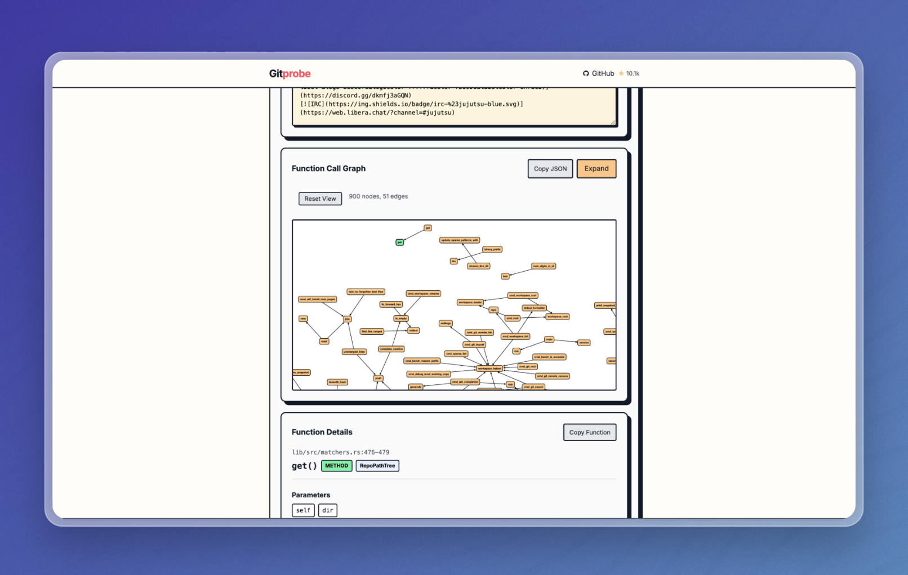

# GitProbe

[](https://github.com/your-org/gitprobe/blob/main/LICENSE)
[](https://www.python.org/downloads/)
[](https://fastapi.tiangolo.com/)

Turn any GitHub repository into comprehensive code analysis with interactive call graphs and multi-language support.

## 🚀 Features

- **Multi-language Analysis**: Support for Python, JavaScript, TypeScript, Rust, Go, C, and C++
- **Tree-sitter Powered**: Advanced syntax parsing with tree-sitter for accurate code analysis
- **Call Graph Generation**: Interactive visualizations showing function relationships
- **Web API**: RESTful API for integration with other tools and frontends
- **Real-time Analysis**: Live progress tracking and results
- **Repository Insights**: File structure, function counts, and relationship mapping
- **LLM-Ready Output**: Structured JSON optimized for AI analysis

## 📸 Preview



*GitProbe's interactive call graph visualization showing function relationships and code structure analysis*

## 📚 Requirements

- Python 3.8+
- Git (for repository cloning)
- Internet access for GitHub repository analysis

## 📦 Installation

```bash
# Clone the repository
git clone https://github.com/your-org/gitprobe.git
cd gitprobe

# Create virtual environment
python -m venv env
source env/bin/activate  # On Windows: env\Scripts\activate

# Install dependencies
pip install -r requirements.txt
```

## 💡 Command line usage

### Start the Web Server

```bash
# Start GitProbe server
./gitprobe server

# Server will be available at http://localhost:8000
# API documentation at http://localhost:8000/docs
```

### CLI Analysis (Legacy)

```bash
# Analyze a GitHub repository
python -m gitprobe https://github.com/user/repository

# With custom output directory
python -m gitprobe https://github.com/user/repository --output ./analysis/
```

## 🌐 Web API Usage

### Analyze Repository

```bash
# Start analysis
curl -X POST "http://localhost:8000/analyze" \
  -H "Content-Type: application/json" \
  -d '{"github_url": "https://github.com/psf/requests"}'
```

### Python API Client

```python
import requests

# Analyze repository
response = requests.post("http://localhost:8000/analyze", json={
    "github_url": "https://github.com/psf/requests",
    "include_patterns": ["*.py"],
    "exclude_patterns": ["*test*", "docs/"]
})

result = response.json()
print(f"Found {result['data']['summary']['total_functions']} functions")
print(f"Languages: {result['data']['summary']['languages_analyzed']}")
```

### Example Response

```json
{
  "status": "success",
  "data": {
    "summary": {
      "total_functions": 235,
      "total_calls": 657,
      "languages_analyzed": ["python"],
      "files_analyzed": 45
    },
    "functions": [...],
    "relationships": [...],
    "visualization": {
      "cytoscape": {...}
    }
  }
}
```

## 🧪 Testing

GitProbe includes a comprehensive integration test suite that validates all language analyzers:

```bash
# Install test dependencies
pip install rich

# Run quick tests (1 repo per language)
python tests/test_integration.py --quick

# Test all languages comprehensive
python tests/test_integration.py

# Test specific language
python tests/test_integration.py --language python

# Verbose output with detailed progress
python tests/test_integration.py --verbose

# JSON output for CI/CD
python tests/test_integration.py --json > results.json
```

### Test Coverage

- **Python**: rich, requests, flask, cpython
- **JavaScript**: lodash, axios, express, node.js
- **TypeScript**: vscode, typescript, angular
- **Rust**: clap, ripgrep, rust compiler
- **Go**: cobra, hugo, kubernetes
- **C**: cJSON, libuv, curl
- **C++**: fmt, catch2, protobuf

## 🏗️ Architecture

```
gitprobe/
├── src/gitprobe/
│   ├── analysis/           # Core analysis engine
│   │   ├── analysis_service.py
│   │   ├── call_graph_analyzer.py
│   │   └── repo_analyzer.py
│   ├── analyzers/          # Language-specific parsers
│   │   ├── python.py       # Python tree-sitter analyzer
│   │   ├── javascript.py   # JavaScript/TypeScript analyzer
│   │   ├── rust.py         # Rust analyzer
│   │   ├── go.py           # Go analyzer
│   │   ├── c_cpp.py        # C/C++ analyzer
│   │   └── ...
│   ├── web/               # FastAPI web server
│   │   └── server.py
│   └── models/            # Data models
│       └── ...
├── tests/                 # Integration test suite
│   ├── test_integration.py
│   └── README.md
└── requirements.txt
```

## 🎯 Language Support

| Language   | Functions | Calls | Classes | Imports | Status |
|------------|-----------|-------|---------|---------|--------|
| Python     | ✅        | ✅    | ✅      | ✅      | Stable |
| JavaScript | ✅        | ✅    | ✅      | ✅      | Stable |
| TypeScript | ✅        | ✅    | ✅      | ✅      | Stable |
| Rust       | ✅        | ✅    | ✅      | ✅      | Stable |
| Go         | ✅        | ✅    | ✅      | ✅      | Stable |
| C          | ✅        | ✅    | ❌      | ✅      | Stable |
| C++        | ✅        | ✅    | ✅      | ✅      | Stable |

## 🔧 Configuration

### Environment Variables

```bash
# Optional: Custom server configuration
export GITPROBE_HOST=0.0.0.0
export GITPROBE_PORT=8000
```

### Analysis Options

```python
# Include/exclude patterns
{
  "github_url": "https://github.com/user/repo",
  "include_patterns": ["*.py", "*.js"],
  "exclude_patterns": ["*test*", "node_modules/", "__pycache__/"]
}
```

## 🤝 Contributing

### Running Tests

```bash
# Start GitProbe server (in one terminal)
./gitprobe server

# Run integration tests (in another terminal)
python tests/test_integration.py --quick
```

### Adding New Languages

1. Create analyzer in `src/gitprobe/analyzers/`
2. Add tree-sitter language dependency to `requirements.txt`
3. Register analyzer in analysis service
4. Add test repositories to `tests/test_integration.py`

### Development Setup

```bash
# Install in development mode
pip install -e .

# Install development dependencies
pip install pytest black isort mypy

# Run code formatting
black .
isort .
```

## 🛠️ Stack

- [Tree-sitter](https://tree-sitter.github.io/) - Syntax parsing and analysis
- [FastAPI](https://fastapi.tiangolo.com/) - Web API framework
- [Pydantic](https://docs.pydantic.dev/) - Data validation and modeling
- [Rich](https://rich.readthedocs.io/) - Beautiful terminal output
- [Cytoscape.js](https://cytoscape.org/) - Graph visualization (frontend)

## 🐛 Known Issues

- Large repositories (>1000 functions) are limited to 900 functions for performance
- Some complex C++ template syntax may not parse correctly
- Private repositories require local cloning

## 📄 License

This project is licensed under the MIT License - see the [LICENSE](LICENSE) file for details.

---

**GitProbe** - Comprehensive multi-language code analysis with interactive call graphs. 